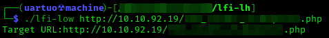
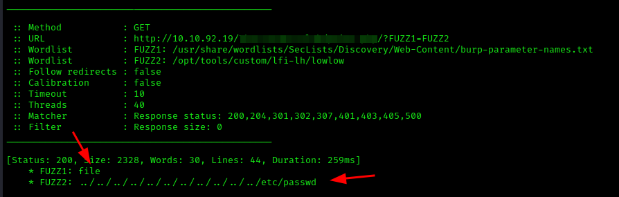

# LFI low-hanging (lfi-lh)
Ferramenta que utiliza o ffuf para automatizar a descoberta de parâmetros através de fuzzing e consequentemente injeta payloads (com e sem bypass) de LFI nesses parâmetros.
Fiz também uma variação do script (lfi-low) com somente 1 payload de LFI para fazer a validação rápida e sem qualquer tipo de bypass.

## Como funciona?
Através de duas listas da SecList, a ferramenta faz um fuzzing inicial de alguns segundos e descobre o valor do tamanho que se repete mais de 10 vezes para criar um filtro.
A partir daí, é aplicado o filtro e a ferramenta começa a rodar.

## Requerimentos
Caso falte algum arquivo, deixei nesse repositório um script chamado *requirements.sh* que instala automaticamente tudo que é necessário para executar o programa.

## Modo de uso:
sudo chmod +x lfi-lh
./lfi-lh **URL**

